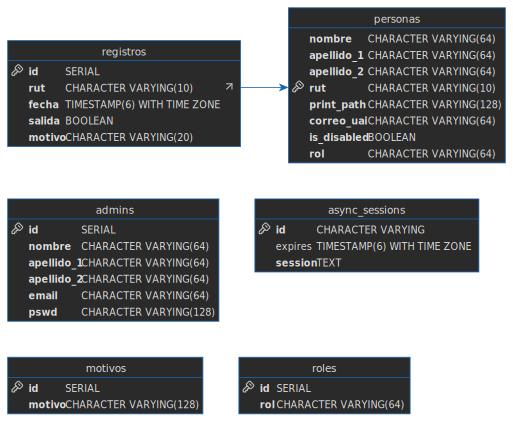

# Database ER Diagram
<p align="center">

</p>

# API Routes
## Usuarios (`/api/usuarios`)

### `GET /api/usuarios`
Gets all the usuarios from the database. This request requires authentication using the `Cookie` header. 
```
GET /api/usuarios
```

|Field|Type|In|Descripcion|
|-|-|-|-|
|cookie| String|Header|cookie header must include an authorization cookie under the name `auth-cookie`. i.e `auth-cookie=<cookie-value>` |
### `GET /api/usuarios/enroll`
Starts enroll of a new user. This is a get request that gets upgraded to a websocket. Once the client should open a ws connection to this route with a message with the following format.

Example:
```json
{
	"nombre": "John",
	"apellido_1": "Doe",
	"apellido_2": "Some",
	"rut": "123939331",
	"correo_uai": "some@correo.cl",
	"is_disabled": false,
	"rol": "ayudante"
}
```

|Field|Type|In|Descripcion|
|-|-|-|-|
|cookie| String|Header|cookie header must include an authorization cookie under the name `auth-cookie`. i.e `auth-cookie=<cookie-value>` |
| nombre| String|Message|Nombre of the new usuario to enroll|
|apellido_1|String|Message| Apellido 1 of the new usuario to enroll|
|apellido_2|String|Message| Apellido 2 of the new usuario to enroll|
|rut| String| Message| Rut of the new usuario to enroll, this must be a valid rut, or else the request websocket will close with failure|
|correo_uai|String|Message| Email of the new usuario to enroll, this must be a valid email.|
|is_disabled| Boolean| Message| If the user is disabled or not, this can be either true or false, any other value will cause the websocket to close|
|rol| String| Message | This can be either "alumno", "ayudante" or "docente", case sensitive, if the does not match any of the previous one, the websocket will close|

### `PUT /api/usuarios/:rut`
Put request to edit an existing usuario. If the RUT doesn't exists 404 is returned.
The body can have the following fields; every one of them are optional.

Example:
```json
{
	"nombre": "Jhon",
	"apellido_1": "Doe",
	"apellido_2": "Some",
	"correo_uai": "some@email.com",
	"rut": "123456789",
	"rol": "ayudante"
}
```

|Field|Type|In|Descripcion|
|-|-|-|-|
|cookie| String|Header|cookie header must include an authorization cookie under the name `auth-cookie`. i.e `auth-cookie=<cookie-value>` |
| nombre| String|Message|__OPTIONAL__ Nombre of the new usuario to enroll|
|apellido_1|String|Message|__OPTIONAL__ Apellido 1 of the new usuario to enroll|
|apellido_2|String|Message|__OPTIONAL__ Apellido 2 of the new usuario to enroll|
|correo_uai|String|Message|__OPTIONAL__ Email of the new usuario to enroll, this must be a valid email.|
|rut| String| Message|__OPTIONAL__ Rut of the new usuario to enroll, this must be a valid rut, or else the request websocket will close with failure|
|rol| String| Message |__OPTIONAL__ This can be either "alumno", "ayudante" or "docente", case sensitive, if the does not match any of the previous one, the websocket will close|

### `GET /api/usuarios/:rut`
Get a specific user by rut. If the rut is not valid or the a user with that rut doesn't exists, 404 is returned. 

Example:
```
GET /api/usuarios/209449211
```

|Field|Type|In|Descripcion|
|-|-|-|-|
|cookie| String|Header|cookie header must include an authorization cookie under the name `auth-cookie`. i.e `auth-cookie=<cookie-value>` |

### `DELETE /api/usuarios/:rut`
Delete a specific user by rut. If the rut is not valid `404` is returned, if a user with that rut doesn't exists, `204` is returned.

Example: 
```
DELETE /api/usuarios/209349492
```

|Field|Type|In|Descripcion|
|-|-|-|-|
|cookie| String|Header|cookie header must include an authorization cookie under the name `auth-cookie`. i.e `auth-cookie=<cookie-value>` |

### `POST /api/usuarios/verify`
Verify a rut, this will activate the attached fingerprint sensor device. The body must provide a `salida` and `motivo` value.

Example:
```json
{
	"salida": false,
	"motivo": "ventana"
}
```
If `salida` is `true` then `motivo` __MUST__ be `salida`

|Field|Type|In|Descripcion|
|-|-|-|-|
|cookie| String|Header|cookie header must include an authorization cookie under the name `auth-cookie`. i.e `auth-cookie=<cookie-value>` |
| salida| Boolean| Body| If the user is going out or not, this can be either `true` or `false`|
|motivo| String| Body | This can be "ventana", "investigacion", "ramo" or "salida", any other value will result in a request error.


## Registros(`/api/registros`)
### `GET /api/registros?limit=<int>&offset=<int>`
Get all registros from the database with offset and limit, if these are not provided, the default is `limit = 100` and `offset = 0`.

Example: 
```
GET /api/registros?limit=10&offset=10
```

|Field|Type|In|Descripcion|
|-|-|-|-|
|cookie| String|Header|cookie header must include an authorization cookie under the name `auth-cookie`. i.e `auth-cookie=<cookie-value>` |
|limit| Integer | Query param | Limit the number of registros to fetch|
|offset| Integer | Query param | Offset of the registros to fetch|

### `GET /api/registros/last/:rut`
Get's the last registro of the given rut, if the `rut` is not valid, status code `400` is returned. If the user with the provided rut doesn't exists, status code `204` is returned.

Example:
```
GET /api/registros/last/204942911
```

|Field|Type|In|Descripcion|
|-|-|-|-|
|cookie| String|Header|cookie header must include an authorization cookie under the name `auth-cookie`. i.e `auth-cookie=<cookie-value>` |

### `POST /api/registros`
Post a new registro to the database. 

Example: 
```json
{
	"rut":"204941023",
	"salida": false,
	"motivo": "ventana"
}
```

|Field|Type|In|Descripcion|
|-|-|-|-|
|cookie| String|Header|cookie header must include an authorization cookie under the name `auth-cookie`. i.e `auth-cookie=<cookie-value>` |
|rut| String| Body | Rut associated with the new registro that you are trying to post | 
| salida| Boolean| Body| If the user is going out or not, this can be either `true` or `false`|
|motivo| String| Body | This can be "ventana", "investigacion", "ramo" or "salida", any other value will result in a request error.


## Admin(`/api/admin`)
### `POST /api/admin/login`
Login. This will return a cookie string that the user should use all the next request.

Example:
```json
{
	"email": "some@email",
	"pswd": "somepassword"
}
```
The response will have the following format alongside a status code `200` if the credential are the right ones:
```json
{
	"nombre": "Some",
	"apellido_1": "Last",
	"apellido_2": "Name",
	"email": "some@email.com",
	"cookie": "<cookie-value>"
}
```
Else a response `401` will be returned.

|Field|Type|In|Descripcion|
|-|-|-|-|
| email| String| Body| email of the user trying to login |
|pswd| String | Body | password of the user trying to login|

### `POST /api/admin/signin`
Create a new admin user, this request can only be made with a valid `cookie` value. Hence only authorized admins can create new admins. 

Example: 
```json
{
	"nombre": "John",
	"apellido_1": "Doe",
	"apellido_2": "Else",
	"email": "email@some.com",
	"pswd": "some_pswd"
}
```
The response has the following format: 
```json
{
	"nombre": "John",
	"apellido_1": "Doe",
	"apellido_2": "Some",
	"email": "some@email.com"
}
```

|Field|Type|In|Descripcion|
|-|-|-|-|
|cookie| String|Header|cookie header must include an authorization cookie under the name `auth-cookie`. i.e `auth-cookie=<cookie-value>` |
|nombre| String|Body|name of the new admin|
|apellido_1|String|Body|apellido 1 of the new admin|
|apellido_2| String| Body| apellido 2 of the new admin|
|email|String| Body| email of the new admin|

### `POST /api/admin/logout`

This post request will delete the session from the database resulting in a `backend` side logout. The client should remove the cookie from the browser as well. In the request, the cookie header should have the `auth-cookie` value to delete. 

Example:
```
POST /api/admin/logout
```

|Field|Type|In|Descripcion|
|-|-|-|-|
|cookie| String|Header|cookie header must include an authorization cookie under the name `auth-cookie`. i.e `auth-cookie=<cookie-value>` |

