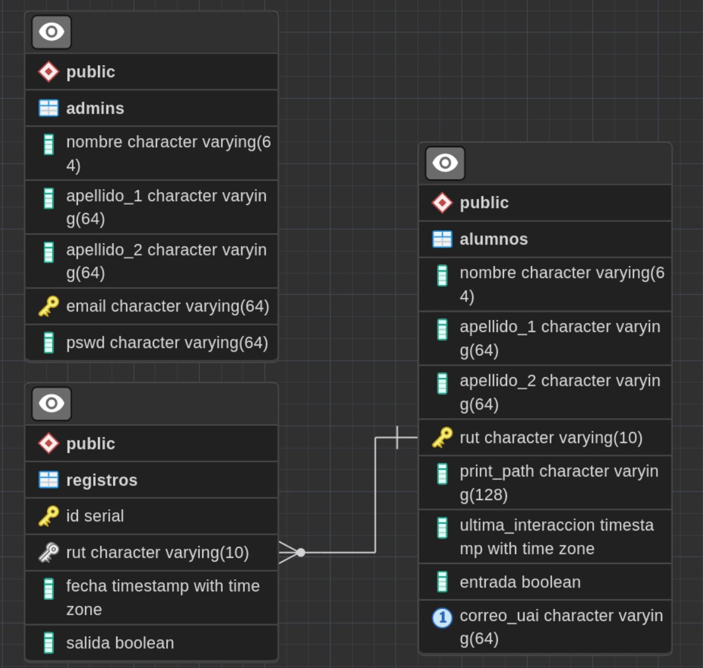

# Database ER Diagram
<p align="center">

</p>

# API Routes
## ADMIN
### `POST /admin/login`
```json
{
    "email": "some@email.com",
    "pswd": "some_password"
}
```
| Field| Type|In| Description |
|-|-|-|-|
|`email`|String|Body|**Required** Email of the account you are trying to access|
|`pswd`|String|Body|**Required** Password of the account you are trying to login to|

RESPONSE: `200 OK` in case of success `500 INTERNAL SERVER ERROR` if not.

Response example:
```json
{
    "nombre": "John",
    "apellido_1": "Doe",
    "apellido_2": "Foo",
    "email": "dfoo@email.com",
    "token": "eyJ0eXAiOCJhbGciOiJIUzI1.dCI6MTY4NTkzMzU1OX0.TBFaq4kcpYzGOcft1XPnEJJ69vLgM"
}
```
### `POST /admin/signin`

```json
{
    "nombre": "John",
    "apellido_1": "Doe",
    "apellido_2": "Foo",
    "email": "dfoo@email.com",
    "pswd": "some_password"
}
```
| Field| Type|In| Description |
|-|-|-|-|
|`nombre`|String|Body|**Required** Name of the new admin|
|`apellido_1`|String|Body|**Required** Lastname 1 of the new admin|
|`apellido_2`|String|Body|**Required** Lastname 2 of the new admin|
|`email`|String|Body|**Required** Email of the account you are trying to access|
|`pswd`|String|Body|**Required** Password of the account you are trying to login to|

RESPONSE: `200 OK` in case of success `500 INTERNAL SERVER ERROR` if not.

Response example:
```json
{
    "nombre": "John",
    "apellido_1": "Doe",
    "apellido_2": "Foo",
    "email": "dfoo@email.com",
    "token": "eyJ0eXAiOCJhbGciOiJIUzI1.dCI6MTY4NTkzMzU1OX0.TBFaq4kcpYzGOcft1XPnEJJ69vLgM"
}
```
## Alumnos
### `GET /alumnos`
No body required.


| Field| Type|In| Description |
|-|-|-|-|
|`Authorization`|String|Headers|**Required** Bearer authorization header|
### `POST /alumnos`
```json
{
    "nombre": "John",
    "apellido_1": "Doe",
    "apellido_2": "Foo",
    "rut": "123456789",
    "ultima_interaccion":"2023-11-21 23:21:32",
    "entrada": false,
    "correo_uai": "jdoe@uai.cl"
}
```